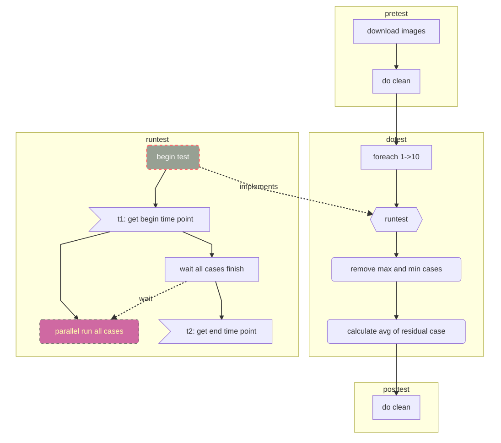

## iSulad

`iSulad` is a lightweight container runtime daemon which is designed for IOT and Cloud infrastructure.`iSulad` has the characteristics of light, fast and not limited by hardware specifications and architecture, and can be applied more widely.

## Getting Started

### Installing
To install iSulad, you can use `rpm` or `yum` package manager command with `openEuler` repository.

Install iSulad with yum
```sh
yum install -y iSulad
```

### Run
We provide `systemd` service to start `iSulad`
```sh
systemctl start isulad # run the server with systemd command
```

You can use direct command to start `iSulad` server：
```sh
$ sudo isulad  # run the server with default socket name and default log level and images manage function
```
### Operations on containers:
`iSulad` provides command line `isulad` to talk with server.
Here are some sample commands to manager containers.

List all containers in your own environment:
```sh
# list containers
$ sudo isula ps -a
```

Create a container with busybox named `test`
```sh
# create a container 'test' with image busybox
$ sudo isula create -t -n test busybox
```

Start this container `test`
```sh
# start the container 'test'
$ sudo isula start test
```
Kill the container `test`
```sh
# kill the container 'test'
$ sudo isula kill test
```
Remove the container `test`
```sh
# remove the container 'test'
$ sudo isula rm test
```

### Build from source
Build requirements for developers are listed in [build_guide](./docs/build_guide.md)

### Integration
Integrate with `kubernetes` are listed in [integration.md](./docs/integration.md)

## Performance

#### Machine configuration

| Configuration | Information                                  |
| ------------- | -------------------------------------------- |
| OS            | Fedora32 X86_64                              |
| kernel        | linux 5.7.10-201.fc32.x86_64                 |
| CPU           | 48 cores，Intel Xeon CPU E5-2695 v2 @ 2.4GHZ |
| memory        | 132 GB                                       |

#### Version of Softwares

| Name      | Version                                                      |
| --------- | ------------------------------------------------------------ |
| iSulad    | Version:	2.0.3 , Git commit:  3bb24761f07cc0ac399e1cb783053db8b33b263d |
| docker    | Version:    19.03.11, Git commit:   42e35e6                  |
| podman    | version 2.0.3                                                |
| CRI-O     | v1.15.4                                                      |
| kubelet   | v1.15.0                                                      |
| cri-tools | v1.15.0                                                      |

#### Design of testcase



About code of test

- [x] Now, we use shell to finish test cases of performance;

- [ ] Future, we should have a repository which store all test cases for iSula. Such as, performance tests, validation tests and so on... [It's coming soon](https://gitee.com/openeuler/iSulad/wikis/2020-%E4%B8%8B%E5%8D%8A%E5%B9%B4%E7%89%B9%E6%80%A7%E8%B7%AF%E6%A0%87?sort_id=2471417)...

#### Compare with other container engines

##### run operator once

base operators of client

| operator (ms) | Docker | Podman | iSulad | vs Docker | vs Podman |
| ------------- | ------ | ------ | ------ | --------- | --------- |
| create        | 287    | 180    | 87     | -69.69%   | -51.67%   |
| start         | 675    | 916    | 154    | -77.19%   | -83.19%   |
| stop          | 349    | 513    | 274    | -21.49%   | -46.59%   |
| rm            | 72     | 187    | 60     | -16.67%   | -67.91%   |
| run           | 866    | 454    | 195    | -77.48%   | -57.05%   |

base operators of CRI

| operator (ms) | Docker | CRIO | iSulad | vs Docker | vs Podman |
| ------------- | ------ | ---- | ------ | --------- | --------- |
| runp          | 681    | 321  | 186    | -72.69%   | -42.06%   |
| stopp         | 400    | 356  | 169    | -57.75%   | -52.53%   |

##### parallel to run operator 100 times

base operator of client

| operator (ms) | Docker | Podman | iSulad | vs Docker | vs Podman |
| ------------- | ------ | ------ | ------ | --------- | --------- |
| 100 * create  | 4995   | 3993   | 829    | -83.40%   | -79.24%   |
| 100 * start   | 10126  | 5537   | 1425   | -85.93%   | -74.26%   |
| 100 * stop    | 8066   | 11100  | 2273   | -71.82%   | -79.52%   |
| 100 * rm      | 3220   | 4319   | 438    | -86.40%   | -89.86%   |
| 100 * run     | 9822   | 5979   | 2117   | -78.45%   | -64.59%   |

base operators of CRI

| operator (ms) | Docker | CRIO | iSulad | vs Docker | vs Podman |
| ------------- | ------ | ---- | ------ | --------- | --------- |
| 100 * runp    | 13998  | 4946 | 2825   | -79.82%   | -42.88%   |
| 100 * stopp   | 8402   | 4834 | 4543   | -45.93%   | -6.02%    |

## How to Contribute

We always welcome new contributors. And we are happy to provide guidance for the new contributors.
iSulad follows the kernel coding conventions. You can find a detailed introduction at:

- https://www.kernel.org/doc/html/v4.10/process/coding-style.html

## Licensing

iSulad is licensed under the Mulan PSL v2.
